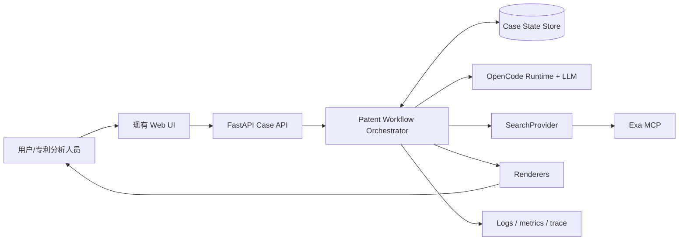
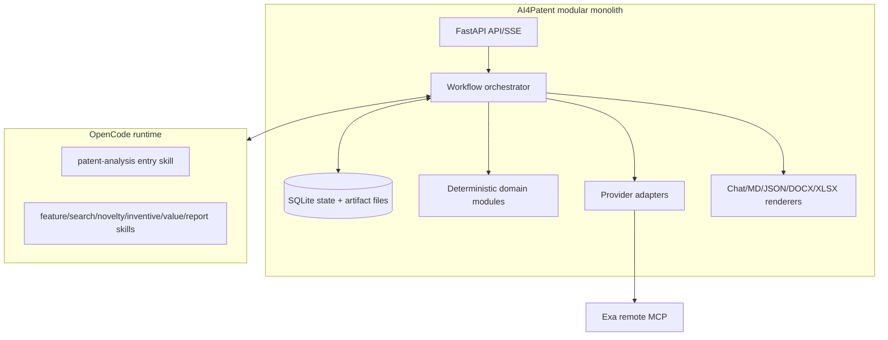
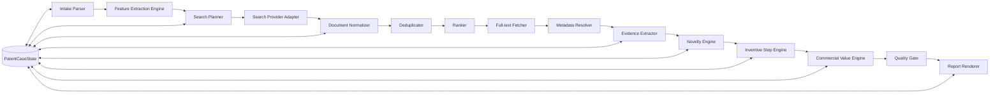
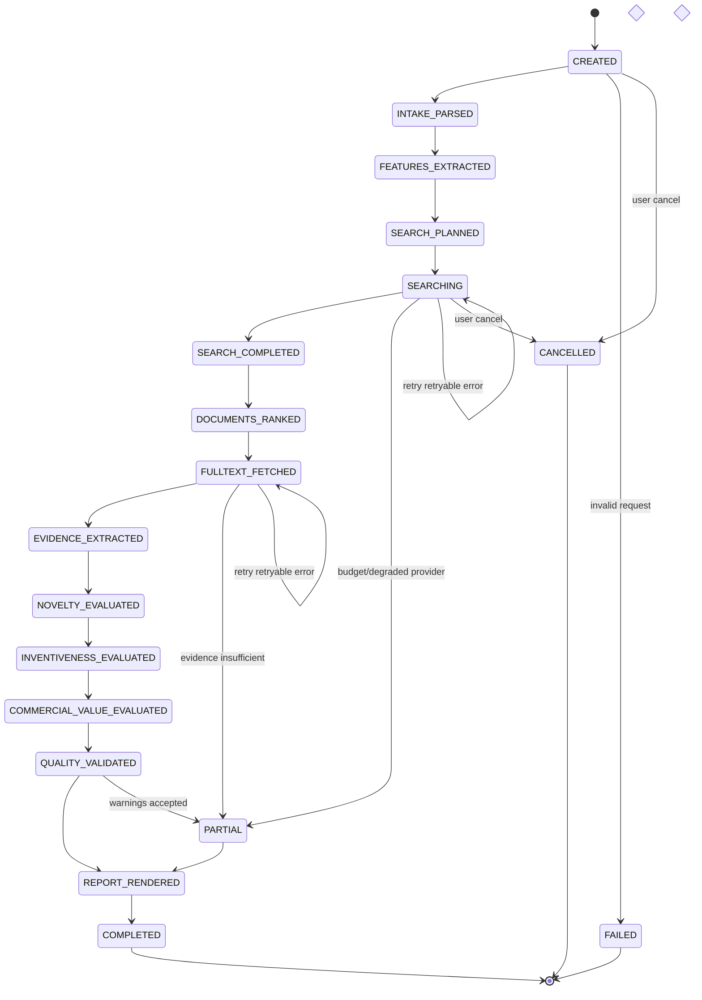
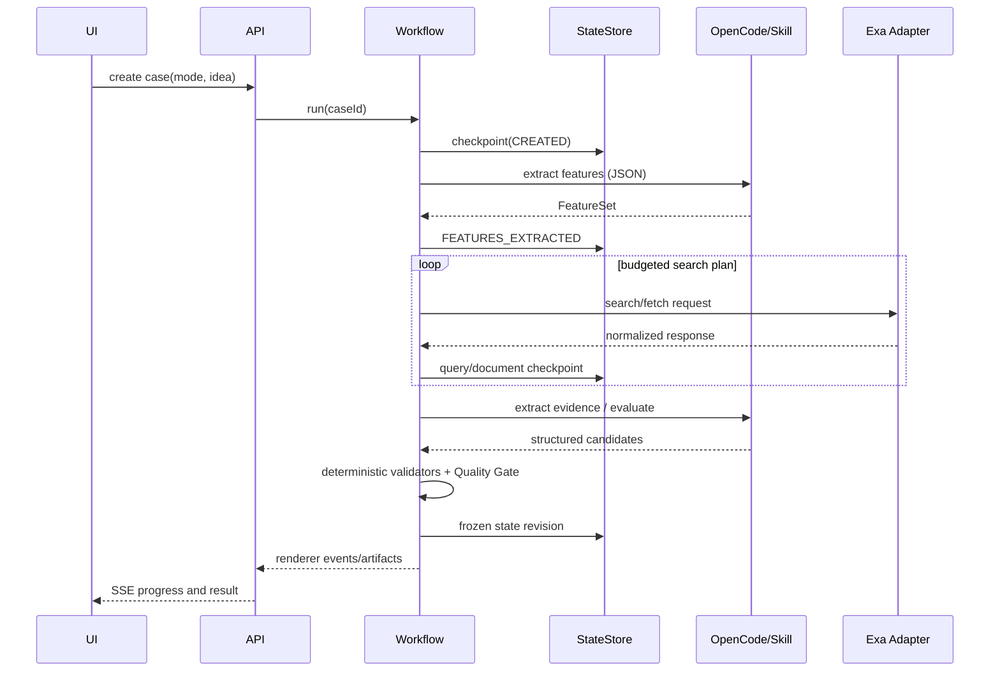

# Patent Innovation Analysis Agent

## 重构工程设计说明书

| 项 | 内容 |
| --- | --- |
| 版本 | 0.1.0-draft |
| 状态 | 设计基线，待实施 |
| 适用项目 | `AI4Patent` |
| 目标读者 | 产品负责人、专利分析人员、后端/Agent 工程师、后续 Code Agent |
| 原始业务规则 | `config/opencode/skills/patent-IDEA-analyzer/SKILL.md`（1,104 行） |
| 首选实施形态 | Python 模块化单体，继续由 FastAPI 承载；OpenCode 是 Agent Runtime |

## 1. 摘要、术语与边界

本设计将当前“把 1,104 行规则随一次 OpenCode 会话加载、由模型在上下文内保管全部中间结果”的实现，逐步重构为：

```text
模块化 Skill + 状态驱动 Workflow + 工具适配层 + 证据绑定评估
+ 预算控制 + 确定性校验 + 独立 Renderer
```

| 术语 | 含义 |
| --- | --- |
| 案件（Case） | 一次专利 Idea 分析及其全部输入、中间数据和产物。 |
| `PatentCaseState` | 案件可持久化的唯一事实来源（source of truth）。 |
| 特征 | 归一化的必要/可选技术特征，ID 形如 `F-001`。 |
| 文献 | 专利、论文、标准、白皮书等现有技术，ID 形如 `DOC-001`。 |
| 证据 | 可定位的原文事实，ID 形如 `EV-001`。 |
| 路线 | 以一个 D1 及 D2/D3 的创造性三步法分析，ID 形如 `ROUTE-001`。 |
| 法律模拟结论 | 系统的检索与技术分析意见，不是正式法律意见。 |

### 1.1 目标

- 保留原 Skill 的特征解析、混合检索、新颖性、创造性三步法、运营价值、模拟审查意见和多格式报告能力。
- 任何确定性法律模拟结论均可追溯至证据；**No Evidence → No Legal Conclusion**。
- 可从 checkpoint 恢复，按 Quick / Standard / Deep / Commercial 模式运行。
- Exa 是首个 `SearchProvider` 实现，而不是领域模型中的硬编码依赖。
- 支持单元、契约、集成、Golden Case 与 Skill 行为回归测试。
- 允许从现有 UI 和 `opencode run` 渐进迁移，原 Skill 在通过回归前保留且可回滚。

### 1.2 非目标

- 不替代执业专利代理师、律师或法定检索结论；不承诺绝对穷尽。
- 首期不自建全球专利库、不训练专用模型、不引入 Kafka、Kubernetes 或分布式事务。
- 首期不重做现有原生前端 GUI；只在其已有的“IDEA 评审”入口上增加模式、案件和恢复能力。
- 不假设 Exa 返回完整的权利人、家族、引用或法律状态字段。

## 2. 当前仓库事实、问题与假设

### 2.1 已核实事实

| 区域 | 当前实现 | 影响 |
| --- | --- | --- |
| `frontend/index.html` | IDEA 按钮把“加载 `patent-IDEA-analyzer` Skill”直接拼进用户提示词，并要求单次完整执行。 | 运行模式、case ID、可恢复状态尚未成为 API 契约。 |
| `backend/main.py` | FastAPI 提供配置、上传、`/api/run` SSE 和停止 API。 | 是新增案件 API 与状态查询的自然入口。 |
| `backend/opencode_client.py` | 只包装一次 `opencode run --format json` 会话，最多保留运行中进程与 OpenCode session ID。 | OpenCode session 不是业务案件状态；断开后无法可靠恢复分析。 |
| `config/opencode/opencode.json` | 配置 DeepSeek provider 与远程 Exa MCP。 | Exa 是 Runtime 工具，尚无 Python 可直接调用的 Adapter。 |
| `config/opencode/AGENTS.md` | 规定使用 `exa_web_search_exa`、`exa_web_fetch_exa` 和 Google Patents URL 规则。 | 应迁入 Provider/Fetcher 契约与 Skill reference，不能散落于全局提示。 |
| 原始 Skill | 同时包含流程、提示、检索次数、数据字段、判断规则、Word/Excel 输出和检查表。 | 是业务规则基线，不是目标执行架构。 |

### 2.2 关键问题

1. 规则和模板同载入，单次上下文重、渐进披露缺失。
2. 特征、查询、文献、证据和结论仅存于模型上下文与流式文本，无法校验或恢复。
3. 检索、抓取、法律分析、生成文件耦合；固定“8 次、10 篇、3 条 D1”不能反映证据收益。
4. 文献日期、链接、权利人、覆盖关系与最终结论没有机器可验证的关联。
5. 现有日志可能记录提示、工具输入与模型输出；对未公开 Idea 缺少最小化与脱敏边界。

### 2.3 假设与待仓库核实事项

- **待核实：** OpenCode 是否提供可由 Python 稳定调用的 MCP 工具执行 API。当前代码仅证明 Agent 会话可使用远程 MCP，未证明后端可直接调用 Exa。
- 在该能力确认前，首版 `ExaAdapter` 可采用“受约束 Agent 工具执行”桥接：代码发出结构化 `SearchRequest`，专用检索 Skill 调 Exa，模型必须返回经过 Schema 校验的 `SearchResponse`。该桥接有可替换边界，不能被误称为直接 Exa SDK。
- 案件状态首选 SQLite（单机、事务和查询足够）+ `workspace/cases/<caseId>/artifacts/`，无需新增服务；具体依赖库在实现扫描后决定。
- 目标目录是建议。若实际仓库结构不同，以仓库现状为准，不得为了套模板进行无意义重构。

## 3. 总体架构

### 3.1 Context Diagram



### 3.2 Container and control flow



控制流是 Orchestrator 的状态转换、重试、预算和 checkpoint；工具流是 `SearchRequest → SearchResponse`、`FetchRequest → FetchResponse`。二者不得由自由文本相互替代。模型只处理语义工作：提取、同义词扩展、语义映射、技术启示及受约束的商业判断；ID、日期、预算、排序、去重、Schema 和报告一致性由代码处理。

### 3.3 组件职责



| 组件 | 职责 | 禁止承担 |
| --- | --- | --- |
| Entry Skill | 识别任务、说明模式、要求读取/写回 State。 | 维护完整中间表、直接裁定无证据结论。 |
| Workflow | 状态迁移、幂等步骤、checkpoint、预算、错误策略。 | 解析原始专利文本。 |
| Domain modules | ID、日期、去重、排序、Schema、质量门。 | 调用 LLM 自由推理。 |
| LLM Skills | 产生受 Schema 约束的语义候选与解释。 | 修改状态机、超预算执行。 |
| Search Provider | 搜索和抓取的统一接口。 | 新颖性或创造性判断。 |
| Evidence Extractor | 将原始文本定位到特征。 | 通过摘要编造段落号。 |
| Evaluators | 根据证据图形成结构化法律模拟判断。 | 直接渲染 Markdown。 |
| Renderers | 从冻结的 State 生成视图或文件。 | 改写事实或重新检索。 |

## 4. 运行模式、预算与停止

| 模式 | 默认输出 | `maxSearchCalls` / `maxFetchCalls` / `maxFullTextDocuments` | 路线 | 最低证据标准 |
| --- | --- | --- | --- | --- |
| Quick Screening | Chat + JSON 摘要 | 6 / 6 / 4 | 0–1 | 关键风险必须有可定位证据；明确非穷尽。 |
| Standard Analysis | 完整 Markdown + JSON | 16 / 16 / 12 | 1–3 | 新颖性候选均有覆盖矩阵；主要路线有 D1/D2 证据。 |
| Deep Examination | Markdown + JSON，可选 DOCX/XLSX | 36 / 35 / 28 | 3–5 | 家族/引用扩展、差异特征专项检索、完整证据矩阵。 |
| Commercial Strategy | Chat/MD + JSON | 12 / 12 / 10 | 0–2 | 对价值判断标明事实来源与商业推断，检索不强行等同 Deep。 |

所有模式另有 `maxDocuments`、`maxTokens`、`maxWorkflowDuration`、`maxRetriesPerTool`、`maxD2PerFeature`。具体数值放在配置而非 Skill。停止条件按优先级为：用户取消；发现申请日前单篇完整且证据完整的覆盖文献；预算耗尽；达到该模式最低证据标准且连续两轮新增有效文献率低于阈值；连续两轮未提高最高特征覆盖；不可恢复的状态/数据错误。提前停止仍可进行后续可支持的分析；预算耗尽必须输出 `PARTIAL`，列出完成项、缺口、风险和继续运行建议。

## 5. Workflow、状态机与恢复

### 5.1 状态图



### 5.2 迁移规则

| 状态 | 进入条件 | 退出/产物 | 重试与恢复 |
| --- | --- | --- | --- |
| `CREATED` | 生成 case、冻结输入和配置快照。 | 输入通过基本 Schema。 | 幂等创建键为 request hash。 |
| `INTAKE_PARSED` | Intake Parser 输出结构化请求。 | 法域、日期边界、模式、不确定项已记录。 | Schema 失败最多一次 LLM 修复后 `FAILED`。 |
| `FEATURES_EXTRACTED` | Feature Engine 生成稳定 `F-*`。 | 必要特征不为空；特征证据指回用户输入。 | 以 input hash 缓存。 |
| `SEARCH_PLANNED` | Query Planner 输出分阶段计划。 | 每个查询有目标/语言/阶段/预算。 | 可重建，不覆盖已完成 run。 |
| `SEARCHING` / `SEARCH_COMPLETED` | Provider 写入原始和规范化结果。 | 预算/停止判断通过。 | 每请求有 idempotency key；退避重试。 |
| `DOCUMENTS_RANKED` / `FULLTEXT_FETCHED` | 排序和抓取计划完成。 | 每个抓取有版本、URL 验证状态。 | 单文献失败降级，不重复成功抓取。 |
| `EVIDENCE_EXTRACTED` | Evidence 有有效定位和 feature ID。 | Evidence Validator 通过。 | 无定位可保留为线索，不能进入结论。 |
| `NOVELTY_EVALUATED` / `INVENTIVENESS_EVALUATED` | Evaluator 使用有效证据。 | 单篇覆盖/路线均含 ID 引用。 | 输入 hash 未变则复用。 |
| `COMMERCIAL_VALUE_EVALUATED` | 价值事实和推断分开保存。 | 每个维度有置信度与依据。 | 可独立重跑。 |
| `QUALITY_VALIDATED` | Quality Gate 对冻结 State 校验。 | error 为零才可确定性完成。 | 允许 warning 形成 `PARTIAL`。 |
| `REPORT_RENDERED` | Renderer 使用 State revision。 | 产物含 state revision/hash。 | 渲染失败不破坏分析 State。 |

每个步骤先记录 `RUNNING` checkpoint，再以单个事务写入结果、消耗预算和目标状态。恢复时选择最后一个成功 checkpoint；未完成的 idempotency key 可查询或安全重试。禁止从会话自然语言“猜回”丢失状态。

### 5.3 时序



## 6. 核心数据模型

### 6.1 TypeScript 契约（跨语言规范）

Python 实现应使用 Pydantic 对应模型并导出同一 JSON Schema；此 TypeScript 是跨 Renderer、MCP 和前端的规范，不要求把当前 FastAPI 后端改为 TypeScript。

```ts
type CaseStatus =
  | "CREATED" | "INTAKE_PARSED" | "FEATURES_EXTRACTED"
  | "SEARCH_PLANNED" | "SEARCHING" | "SEARCH_COMPLETED"
  | "DOCUMENTS_RANKED" | "FULLTEXT_FETCHED" | "EVIDENCE_EXTRACTED"
  | "NOVELTY_EVALUATED" | "INVENTIVENESS_EVALUATED"
  | "COMMERCIAL_VALUE_EVALUATED" | "QUALITY_VALIDATED"
  | "REPORT_RENDERED" | "COMPLETED" | "FAILED" | "PARTIAL" | "CANCELLED";

interface Feature { id: `F-${string}`; text: string; kind: "necessary"|"optional";
  limitation: "functional"|"structural"|"parameter"|"step"; source: EvidenceRef[]; }
interface EvidenceRef { evidenceId: `EV-${string}`; relationship: "supports"|"contradicts"|"context"; }
interface ExecutionBudget { maxSearchCalls:number; maxFetchCalls:number; maxDocuments:number;
  maxFullTextDocuments:number; maxTokens:number; maxWorkflowDurationSeconds:number;
  maxRetriesPerTool:number; maxD1Routes:number; maxD2PerFeature:number;
  consumed: Record<string, number>; }
interface PatentCaseState {
  schemaVersion: "1.0"; case: { id:string; status:CaseStatus; revision:number; createdAt:string; updatedAt:string };
  request: { idea:string; requestedOutputs:string[]; inputHash:string }; mode:"quick"|"standard"|"deep"|"commercial";
  jurisdiction:string[]; priorityDate?:string; invention:Record<string, unknown>; features:Feature[];
  claims:Record<string, unknown>[]; searchPlan?:SearchPlan; queries:Query[]; searchRuns:SearchRun[];
  documents:PriorArtDocument[]; patentFamilies:PatentFamily[]; ranking:RankingResult[]; fullText:FullTextRecord[];
  evidence:EvidenceItem[]; novelty?:NoveltyEvaluationResult; inventiveness?:InventiveStepResult;
  commercialValue?:CommercialValueResult; quality?:QualityGateResult; budget:ExecutionBudget;
  errors:CaseError[]; trace:TraceEvent[]; artifacts:Artifact[];
}
```

稳定 ID 只由代码顺序生成并永不重新编号；删除对象改为 `supersededBy` 或状态标识。`schemaVersion` 采用 `major.minor`：minor 加可选字段，major 用显式迁移函数；每条 State 保存 `migrationHistory`。JSON Schema 必须以 Pydantic/TypeBox 等单一来源生成，禁止手写后漂移。

### 6.2 最小 JSON Schema 片段

```json
{
  "$id": "https://ai4patent.local/schema/patent-case-state/1.0",
  "type": "object",
  "required": ["schemaVersion", "case", "request", "mode", "features", "documents", "evidence", "budget"],
  "properties": {
    "schemaVersion": {"const": "1.0"},
    "case": {"type": "object", "required": ["id", "status", "revision"]},
    "features": {"type": "array", "items": {"type": "object", "required": ["id", "text", "kind"]}},
    "evidence": {"type": "array", "items": {"$ref": "evidence-item.schema.json"}}
  }
}
```

### 6.3 证据模型与不变式

```ts
interface EvidenceItem {
  id: `EV-${string}`; documentId: `DOC-${string}`; documentVersion: string;
  sourceType: "patent"|"paper"|"standard"|"whitepaper"|"user-input";
  sourceUrl?: string; locationType: "claim"|"paragraph"|"page"|"section"|"abstract";
  claimNumber?: string; paragraphRange?: string; pageRange?: string; section?: string;
  quotedText: string; normalizedMeaning: string; featureIds: string[];
  supports: string[]; confidence: number; verified: boolean;
  verificationMethod: "source-fetch"|"user-provided"|"manual"; extractedAt: string;
}
```

- `verified=true` 时必须有 `sourceUrl`（用户输入除外）、`quotedText` 和至少一个定位字段。
- 专利事实（公开日、权利人、分类号）必须来自 document metadata evidence；模型摘要与法律推断分开存储。
- 新颖性“破坏”要求：同一 `documentId`、申请日前有效、每个必要特征有直接且无歧义的有效证据。
- 创造性路线要求：D1、区别特征、D2/D3、技术启示/结合动机以及阻碍/协同效果判断各有证据或明确标记证据不足。

### 6.4 示例（截断）

```json
{"schemaVersion":"1.0","case":{"id":"case_01J...","status":"EVIDENCE_EXTRACTED","revision":12},"mode":"standard","jurisdiction":["CN"],"features":[{"id":"F-001","text":"依据工作负载动态调整缓存分层","kind":"necessary","limitation":"step","source":[{"evidenceId":"EV-001","relationship":"supports"}]}],"documents":[{"id":"DOC-001","type":"patent","publicationNumber":"US1234567A1","publicationDate":"2021-01-01"}],"evidence":[{"id":"EV-101","documentId":"DOC-001","documentVersion":"sha256:...","sourceType":"patent","sourceUrl":"https://patents.google.com/patent/US1234567A1/en","locationType":"claim","claimNumber":"1","quotedText":"...","normalizedMeaning":"动态选择缓存层级","featureIds":["F-001"],"supports":["novelty:DOC-001:F-001"],"confidence":0.92,"verified":true,"verificationMethod":"source-fetch","extractedAt":"2026-07-13T00:00:00Z"}],"budget":{"maxSearchCalls":16,"maxFetchCalls":16,"maxDocuments":60,"maxFullTextDocuments":12,"maxTokens":160000,"maxWorkflowDurationSeconds":1800,"maxRetriesPerTool":2,"maxD1Routes":3,"maxD2PerFeature":2,"consumed":{"searchCalls":4}}}
```

## 7. 模块与接口契约

### 7.1 输入、解析与检索

| 模块 | 输入 | 输出 | 确定性约束 |
| --- | --- | --- | --- |
| Intake Parser | 用户文本/附件索引/默认配置 | 技术方案、领域、法域、优先权日、模式、不确定项 | 不足信息使用默认值；不阻塞提问。 |
| Feature Extraction Engine | intake + 用户来源文本 | `FeatureSet`、问题、效果、主题、检索概念 | 特征 ID 和输入定位由代码生成；模型仅填语义。 |
| Search Planner | 特征、模式、已有结果/预算 | `SearchPlan` 阶段 A–D | 不输出只供人读的建议；每查询有目的和上限。 |
| Normalizer | Provider 原始响应 | `PriorArtDocument` | URL 规范化、日期解析、来源保存。 |
| Deduplicator | 规范化文献 | canonical documents / family links | 使用 publication/application/family/内容/规范 URL；保留来源。 |
| Ranker | 文献、特征、问题、分类、日期 | 多用途分数与理由 | 可配置权重、版本化公式。 |

```ts
interface SearchProvider {
  search(request: SearchRequest): Promise<SearchResponse>;
  fetch(request: FetchRequest): Promise<FetchResponse>;
}
interface SearchRequest { requestId:string; query:string; language:"zh"|"en"; phase:"A"|"B"|"C";
  types:("patent"|"paper"|"standard"|"web")[]; limit:number; idempotencyKey:string; timeoutMs:number; }
interface FetchRequest { requestId:string; urls:string[]; maxCharacters:number; idempotencyKey:string; timeoutMs:number; }
```

`ExaAdapter` 必须映射搜索、抓取、429/5xx/超时、URL 无效与 Schema 失败；采用指数退避且不得重试认证/格式错误。Google Patents URL 要先实际抓取验证。无法取得 Assignee、公开日、全文时，`PatentMetadataResolver` 写入字段状态（`verified`/`missing`/`conflicting`），不填“未知”伪装完整。

检索按阶段进行：A（技术手段、问题、效果、中英文、分类、语义召回）；B（家族、引用、相邻分类、同申请人、关键发明人、NPL）；C（区别特征稳定后的专项查询）；D（停止判定）。原 Skill 的“手段导向”和“问题/效果导向”成为 A 的两类 query intent，而非固定八次调用。

### 7.2 排序与抓取优先级

```text
baseScore = wF*featureCoverage + wField*fieldSimilarity + wProblem*problemSimilarity
          + wClaim*claimSimilarity + wClass*classificationSimilarity
          + wCitation*citationSignal + wSource*sourceReliability + wDate*dateValidity
          - wPenalty*(duplicateRisk + missingMetadata + postPriorityPenalty)
noveltyScore = baseScore + wComplete*necessaryFeatureCoverage
d1Score = baseScore + wClosest*problemSimilarity + wCoverage*necessaryFeatureCoverage
d2Score = baseScore + wDifference*distinguishingFeatureCoverage + wMotivation*combinationSignal
fetchPriority = 0.45*max(noveltyScore,d1Score,d2Score) + 0.35*uncertainty + 0.20*metadataCompleteness
```

权重在模式配置中版本化；排序输出保存每个分项。抓取选择最高优先级的未验证文献，直到模式的最小充分证据、收益递减或预算边界。高分摘要不能直接作为最终证据；只有摘要可得时只能形成线索或 `PARTIAL`。

### 7.3 评估、质量与渲染

| 模块 | 输出 | 关键规则 |
| --- | --- | --- |
| Evidence Extractor | `EvidenceItem[]` | 抓取版本 hash、原文、定位、语义映射、特征关联；定位缺失不进入强结论。 |
| Novelty Engine | 每文献覆盖矩阵和总结 | 单一文献、全部必要特征、直接无歧义公开、日期有效、证据完整。 |
| Inventive Step Engine | `InventiveStepRoute[]` | 选最接近 D1；识别区别特征和实际问题；逐项验证 D2/D3、结合动机、阻碍、协同和辅助因素。 |
| Commercial Value Engine | 可取证性/规避性/市场/标准化/成熟度/实施方 | 保留事实与商业推断、置信度和局限的区别。 |
| Quality Gate | errors/warnings/blocked conclusions | State 一致性、ID、日期、链接、权利人来源、证据绑定、用语强度。 |
| Renderer | chat/MD/JSON/DOCX/XLSX | 只读取冻结 state revision，产物记录模板与状态 hash。 |

```ts
interface NoveltyEvaluationResult { byDocument: Array<{documentId:string; featureCoverage:Record<string,"yes"|"no"|"partial">; conclusion:"novel"|"not-novel"|"uncertain"; evidenceIds:string[]}>; overall:"novel"|"not-novel"|"uncertain"; }
interface InventiveStepRoute { id:`ROUTE-${string}`; d1DocumentId:string; differenceFeatureIds:string[]; actualTechnicalProblem:string; d2DocumentIds:string[]; motivationEvidenceIds:string[]; obstacleEvidenceIds:string[]; synergyEvidenceIds:string[]; conclusion:"inventive"|"not-inventive"|"uncertain"; }
interface QualityGateResult { passed:boolean; errors:Array<{code:string; path:string; message:string}>; warnings:Array<{code:string; path:string; message:string}>; blockedConclusionIds:string[]; }
interface ReportRenderer { render(state: PatentCaseState, format:"chat"|"markdown"|"json"|"docx"|"xlsx"): Promise<Artifact>; }
```

Quality Gate 必须拦截“无有效 Evidence 的确定性结论”“晚于 priority date 却作为现有技术”“未经验证 URL”“空白权利人却声称已核实”“渲染文案与 State 不一致”。降级文本应为“待验证”“证据不足”“检索范围非穷尽”，不能弱化为肯定的法律结论。

### 7.4 Workflow、预算与 Exa Adapter 代码骨架

```ts
interface WorkflowStep<I, O> {
  name: string; allowedFrom: CaseStatus[]; target: CaseStatus;
  idempotencyKey(input: I, state: PatentCaseState): string;
  run(input: I, state: PatentCaseState): Promise<O>;
}
class BudgetManager {
  constructor(private readonly budget: ExecutionBudget) {}
  reserve(kind: "searchCalls"|"fetchCalls"|"tokens", amount = 1) {
    const limit = ({searchCalls:this.budget.maxSearchCalls, fetchCalls:this.budget.maxFetchCalls,
      tokens:this.budget.maxTokens})[kind];
    if ((this.budget.consumed[kind] ?? 0) + amount > limit) throw new Error(`BUDGET_EXHAUSTED:${kind}`);
    this.budget.consumed[kind] = (this.budget.consumed[kind] ?? 0) + amount;
  }
}
function assertTransition(from: CaseStatus, to: CaseStatus) {
  const allowed: Partial<Record<CaseStatus, CaseStatus[]>> = {
    CREATED:["INTAKE_PARSED","FAILED","CANCELLED"],
    INTAKE_PARSED:["FEATURES_EXTRACTED","FAILED","CANCELLED"],
    FEATURES_EXTRACTED:["SEARCH_PLANNED","FAILED","CANCELLED"],
    QUALITY_VALIDATED:["REPORT_RENDERED","PARTIAL","FAILED"]
  };
  if (!allowed[from]?.includes(to)) throw new Error(`INVALID_TRANSITION:${from}->${to}`);
}
class ExaAdapter implements SearchProvider {
  async search(request: SearchRequest): Promise<SearchResponse> {
    // Implementation decision pending: direct SDK/MCP client if verified; otherwise
    // submit this exact request to the constrained OpenCode MCP bridge and validate its JSON response.
    return validateSearchResponse(await this.transport.execute("exa_web_search_exa", request));
  }
  async fetch(request: FetchRequest): Promise<FetchResponse> {
    return validateFetchResponse(await this.transport.execute("exa_web_fetch_exa", request));
  }
  constructor(private transport: { execute(name:string, payload:unknown): Promise<unknown> }) {}
}
```

工具审计字段为 `toolName, requestId, idempotencyKey, provider, attempt, timeoutMs, rateLimitState, rawArtifactHash, normalizedResponseHash`。标准错误类型：`RATE_LIMITED`、`TIMEOUT`、`UPSTREAM_5XX`、`AUTH_FAILURE`、`INVALID_REQUEST`、`INVALID_RESPONSE`、`URL_UNREACHABLE`、`BUDGET_EXHAUSTED`、`CANCELLED`。前四类的具体重试性按 10.2 表处理；任何 Adapter 都不得把原始工具错误转换成虚假的空结果。

## 8. Skill 与渐进式披露

建议将新增 Skill 放入 `config/opencode/skills/`，不立即移动原目录：

```text
config/opencode/skills/
  patent-IDEA-analyzer/                 # 保留：原始基线和回滚
  patent-analysis/                      # 入口，<= 250 行
    SKILL.md
    references/{case-contract.md,workflow.md,mode-policy.md}
  patent-feature-extraction/SKILL.md
  patent-prior-art-search/
    SKILL.md
    references/{query-policy.md,exa-contract.md,document-rules.md}
  patent-novelty/
    SKILL.md
    references/{single-document-rule.md,evidence-contract.md}
  patent-inventive-step/
    SKILL.md
    references/{three-step-method.md,cross-domain-rule.md}
  patent-commercial-value/
    SKILL.md
    references/{enforcement-and-avoidance.md}
  patent-report/
    SKILL.md
    templates/{report.md,chat-summary.md}
```

启动时只暴露各 Skill 的 frontmatter（名称、能力、触发描述）。Entry 仅在 IDEA 评审触发时加载，先读取 `case-contract` 和模式策略；Feature/Search/Evaluator Skill 仅由对应 workflow step 调用；报告模板只在 Quality Gate 通过后加载。每个子 Skill 的输入/输出均是 schema 名称、state revision 和引用 ID，禁止“记住上一步文本”这类隐式依赖。

将确定性部分移入 Python：状态转移、ID、JSON Schema、预算、日期/优先权比较、URL 规范化、去重、加权评分、字段完整性、产物一致性。保留在 Skills 的规则包括：特征语义拆解、同义词候选、文献含义映射、技术问题归纳、受证据约束的三步法论证、价值推断和面向读者的表达。

## 9. 原 Skill 到目标模块映射

| 原始规则 | 目标承载 | 迁移要求 |
| --- | --- | --- |
| Step 0 | Intake Parser + Entry Skill | 移除“等待用户确认”；保留自动默认。 |
| 1.1–1.2 | Feature Extraction Skill/Engine | 特征变 `F-*`，必须指向用户输入证据。 |
| 1.3 / IPC | Search Planner + query policy | 词库和 query 结构化保存；词数不是验收目标。 |
| 2.1–2.4 | Provider/Normalizer/Ranker/Fetcher | “8 次、≥10 篇”改为模式预算与停止条件。 |
| 2.5–2.6 | Metadata Resolver + Quality Gate | Assignee/链接均要来源和验证状态。 |
| 2.7–2.8 | Ranker + routing policy | 关联度、跨域推断和候选池保留为数据字段。 |
| 3.1–3.4 | Novelty Engine | 单一文献/全部特征/日期/证据为硬校验。 |
| 4.0–4.5 | Inventive Step Engine | D1 路线按模式上限；不强制任何模式固定三条。 |
| 4.6 | Commercial Value Engine | 保留取证、规避、市场三维并增加事实/推断标记。 |
| Step 5 | Examiner-opinion Renderer | 只可基于已通过的最强路线。 |
| Step 6 | Renderers + templates | 从 State 渲染 Chat/MD/JSON/DOCX/XLSX。 |
| 质量清单 | Quality Gate + 测试 | 可程序化项变断言，其余变 Skill eval。 |

## 10. 存储、缓存、错误与可观测性

### 10.1 存储与缓存

`CaseStateStore` 存 SQLite 中的案件元数据、revision、状态迁移、请求和缓存索引；大文本和渲染产物存 `workspace/cases/<caseId>/artifacts/`，表中保存内容 hash。缓存分为 query、search result、URL fetch、metadata、evidence、analysis、render。

缓存键必须包括：规范 query/URL、provider、请求参数、文档版本 hash、schema/prompt/ranker/config 版本；fetch 以内容 hash 失效，搜索/metadata 使用可配置 TTL，分析仅在输入 State revision、模型/Skill 和规则版本均相同才复用。跨案件只能复用公开文献原始数据，不复用用户 Idea、推断、案件结论或未脱敏日志。

### 10.2 错误处理

| 场景 | 策略 |
| --- | --- |
| Exa 临时 429/5xx/超时 | 带抖动退避重试至预算；然后切换 `PARTIAL` 或备用 provider。 |
| Exa 不可用 | 记录 provider failure；若无备用，渲染已验证材料和明确检索缺口。 |
| 单 URL/Google Patents 异常 | 单文献 `fetch_failed`；不阻塞其余任务，不能给未验证链接。 |
| 字段缺失/日期冲突 | Metadata Resolver 记录冲突证据，阻断强法律结论。 |
| LLM 非法 JSON | 一次修复提示；仍失败则该 step `FAILED`/`PARTIAL`，保留原响应 artifact。 |
| Evidence 无定位 | 降级为线索，不支持确定性结论。 |
| 用户输入太少 | `INTAKE_PARSED` 记录不确定项，Quick 或 `PARTIAL` 输出，而不是虚构特征。 |
| 取消/进程中断 | 记录 checkpoint，标记 `CANCELLED`，允许显式 resume。 |

### 10.3 可观测性与安全

结构化日志至少包含 `caseId, runId, stepId, tool, queryId, documentId, durationMs, status, retry, budgetConsumed, errorCode`。指标包含搜索/抓取数与成功率、去重率、有效文献率、全文率、Evidence 完整率、最高特征覆盖率、无证据拦截数、token、时长和步骤失败率。Trace 链接 `Query → Search Result → Document → Evidence → Feature → Conclusion`。

日志默认只保存 hash、长度、可公开文献标识和已脱敏摘要；原始 Idea、API key、上传内容和完整模型提示不得进入普通日志。查询按“实现手段最小必要”构造，避免泄露完整未公开方案；密钥继续仅用文件引用/环境变量；报告必须带检索范围、日期边界、非穷尽和非法律意见声明。定义案件保留期、删除 API 与缓存清理策略后才能上线生产数据。

## 11. 配置、目录与 API 演进

### 11.1 目标目录

```text
backend/
  patent_analysis/
    api.py  domain/{models.py,ids.py,dates.py,ranking.py,validation.py}
    workflow/{orchestrator.py,steps.py,budget.py,transitions.py}
    adapters/{base.py,exa.py,opencode_mcp_bridge.py}
    services/{intake.py,features.py,search.py,documents.py,evidence.py,novelty.py,inventive.py,commercial.py,quality.py}
    persistence/{state_store.py,migrations.py,cache.py}
    renderers/{chat.py,markdown.py,json.py,docx.py,xlsx.py}
    schemas/{patent-case-state.schema.json,evidence-item.schema.json}
  tests/patent_analysis/{unit,contract,integration,golden,fixtures}
config/patent-analysis/{default.yaml,quick.yaml,standard.yaml,deep.yaml,commercial.yaml}
workspace/cases/<caseId>/{state.json,artifacts/,trace/}
docs/patent-innovation-analysis-agent-design.md
```

先扫描 `backend/main.py`、`backend/opencode_client.py`、前端模板、`config/opencode/opencode.json`、`config/opencode/AGENTS.md`、`config/opencode/skills/**/SKILL.md` 和现有 tests/requirements；确认语言、依赖和 OpenCode/MCP 调用方式后再映射以上目录。Exa 配置当前位于 `config/opencode/opencode.json:mcp.exa`；任何现有工具封装应先适配 `SearchProvider`，不要复制一套请求逻辑。

配置层使用 `default.yaml` 共享 schema，模式文件只覆盖 budget、最低证据、权重、输出。环境变量建议：`AI4P_CASE_DB_PATH`、`AI4P_CASE_ROOT`、`AI4P_SEARCH_PROVIDER`、`AI4P_EXA_TIMEOUT_SECONDS`、`AI4P_LOG_REDACTION`、`AI4P_RETENTION_DAYS`；不把 API key 写入这些 YAML。`AI4P_MODEL` 只是默认值，模型版本必须写入 State trace。

`config/patent-analysis/default.yaml` 的最小形态如下；`quick.yaml`、`standard.yaml`、`deep.yaml`、`commercial.yaml` 只覆盖 `modeDefaults.<mode>`，避免四份配置漂移：

```yaml
schemaVersion: 1
provider: exa
model: deepseek/deepseek-v4-flash
language: [zh, en]
jurisdiction: [CN]
allowNonPatentLiterature: true
outputs: [chat, markdown, json]
minimumEvidence:
  requireLocationForLegalConclusion: true
  requireVerifiedSourceUrl: true
modeDefaults:
  standard:
    budget: {maxSearchCalls: 16, maxFetchCalls: 16, maxDocuments: 60, maxFullTextDocuments: 12, maxTokens: 160000, maxWorkflowDurationSeconds: 1800, maxRetriesPerTool: 2, maxD1Routes: 3, maxD2PerFeature: 2}
rankerWeights: {featureCoverage: 0.30, fieldSimilarity: 0.15, problemSimilarity: 0.15, claimSimilarity: 0.15, classificationSimilarity: 0.08, citationSignal: 0.05, sourceReliability: 0.07, dateValidity: 0.05}
```

API 采用兼容式扩展：保留 `/api/run` 作为 legacy；新增 `POST /api/cases`（idea/mode/jurisdiction/output）、`POST /api/cases/{id}/run`、`GET /api/cases/{id}`、`GET /api/cases/{id}/events`、`POST /api/cases/{id}/resume`、`POST /api/cases/{id}/cancel` 和 `GET /api/cases/{id}/artifacts/{name}`。新 UI 先从 legacy 输入创建 Case，再逐步切换至这些 API。

## 12. 测试与验收

### 12.1 测试层次

- 单元：Query Builder、Normalizer、URL/日期、Deduplicator、Ranker、Budget Manager、transition、Evidence Validator、各 Renderer。
- 契约：`SearchProvider`/Exa bridge、MCP 输入输出、Pydantic/JSON Schema、Renderer 输入输出。
- 集成：Quick/Standard/Deep、工具失败、预算耗尽、checkpoint 恢复、legacy `/api/run` 兼容。
- Golden Cases：单篇完整覆盖；多文献分别覆盖；D1+D2 有结合启示；D2 无结合动机；跨领域迁移；晚公开日；全文缺失；Exa 家族重复；Evidence 无定位；预算耗尽；一句模糊 Idea；云端算法低可取证性。
- Prompt/Skill 回归：正确/错误触发、按需加载、JSON 合规、无证据结论拦截、预算耗尽停止。

Golden fixture 必须是可重放的脱敏 provider response，而不是在线 Exa；每次回归要锁定 schema、规则、权重和模板版本。

### 12.2 可验收标准

| 指标 | P0 目标 |
| --- | --- |
| 新入口 Skill 正文 | ≤250 行；复杂规则位于一层 references。 |
| State Schema / transition 测试 | 100% 通过。 |
| 确定性新颖性/创造性结论证据绑定率 | 100%；否则被 Quality Gate 降级。 |
| 晚于优先权日文献作为有效现有技术的拦截 | 100% fixture 覆盖。 |
| 报告与冻结 State 一致性 | 100% fixture 通过。 |
| 同 idempotency key 的重复步骤 | 不重复消耗预算。 |
| checkpoint 恢复 | 集成 fixture 100% 从最近成功步骤继续。 |
| Quick/Standard/Deep 预算 | 超额为 0；耗尽均输出 `PARTIAL`。 |
| Golden Cases | P0 覆盖的 8 个全部通过后才切换默认入口。 |

## 13. 渐进迁移与回滚

| 阶段 | 范围与验收 | 回滚点 |
| --- | --- | --- |
| 0 基线 | 冻结原 Skill，保存代表性输入/输出，建立 Golden fixtures。 | 删除新增测试资产即可。 |
| 1 State/Evidence | 新增 models、store、schema、ID/日期/证据校验；原 Skill 仍驱动流程。 | feature flag 回到 legacy。 |
| 2 搜索解耦 | Provider 接口、Exa bridge、normalizer、cache、dedupe、ranker。 | 继续让原 Skill 原生调用 Exa。 |
| 3 分析引擎 | 新颖性、创造性、商业、Quality Gate 输出结构化结果。 | 只使用旧 Markdown 输出。 |
| 4 Skill 拆分 | 新 Entry/子 Skill/references，双跑并比较 State/报告。 | UI 模板保持原 Skill 名称。 |
| 5 Renderer/API | JSON/MD 首先，随后 DOCX/XLSX；新增 Case API 和恢复。 | legacy `/api/run` 不变。 |
| 6 默认切换 | 回归、隐私、负载验证后将新入口设为默认；原 Skill 标为 legacy。 | feature flag 立即切回 `patent-IDEA-analyzer`。 |

任何阶段不得删除 `config/opencode/skills/patent-IDEA-analyzer/SKILL.md`。数据迁移使用 append-only migration + state backup；渲染产物保留原 `stateRevision`，可重现历史报告。

## 14. Code Agent 实施任务清单

| ID / Title | 优先级 | 目标与依赖 | 文件 | 验收/测试/风险/回滚 |
| --- | --- | --- | --- | --- |
| P0-01 | P0 | 扫描运行方式、依赖、OpenCode MCP 可调用面；无依赖。 | 现有 backend/config/frontend，新增 `docs/architecture-verification.md`。 | 写出已证实/未证实项；不改生产链路；回滚删除文档。 |
| P0-02 | P0 | 建立 Golden 基线，依赖 P0-01。 | 新增 `backend/tests/patent_analysis/golden/**`。 | 12 个离线 fixture、断言原规则关键行为；fixture 不含密钥/Idea；可整体移除。 |
| P0-03 | P0 | State/Evidence Schema、ID、迁移和 validators。 | 新增 `domain/`, `schemas/`, `persistence/migrations.py`。 | Schema/日期/ID 单测全通过；不接入 UI；feature flag 关闭即可回滚。 |
| P0-04 | P0 | State Store、checkpoint、transition、BudgetManager。 | `persistence/`, `workflow/`。 | 幂等和恢复集成测试；SQLite 文件隔离在 workspace；可删新 case DB 回滚。 |
| P0-05 | P0 | SearchProvider、Exa Adapter/bridge、normalizer/dedupe/ranker。 | `adapters/`, `services/documents.py`。 | fake provider 契约测试，重复家族和 URL 规范化通过；保持 legacy Exa 方案。 |
| P0-06 | P0 | 新颖性 Engine 与 Evidence Quality Gate。 | `services/evidence.py`, `novelty.py`, `quality.py`。 | 单篇覆盖、晚日期、无定位均正确；不通过即阻断强结论。 |
| P1-01 | P1 | 创造性路线和商业价值模块。依赖 P0-06。 | `inventive.py`, `commercial.py`。 | D1+D2、有/无动机、跨域 fixture；输出明确推断标签；关闭新 route 可回滚。 |
| P1-02 | P1 | 新的渐进式 Skill 目录与结构化 Agent 契约。 | `config/opencode/skills/patent-*`。 | frontmatter、行数、按需加载 eval；原 Skill 不动。 |
| P1-03 | P1 | JSON/Chat/Markdown Renderer 与报告一致性。 | `renderers/`, templates。 | 同一 State repeatable render；hash/revision 写入 artifact；不替换旧报告。 |
| P1-04 | P1 | Case API、SSE 状态、resume/cancel、前端小范围适配。 | `backend/main.py`, `frontend/index.html`。 | legacy API 回归；新案件可恢复；feature flag 回滚。 |
| P2-01 | P2 | DOCX/XLSX、缓存策略、metrics/traces 和保留期。 | renderers/persistence/observability/config。 | 文件 schema、缓存命中、脱敏日志测试；可关闭产物/观测配置。 |
| P2-02 | P2 | 双跑、性能评估、文档和默认切换。 | docs/config/frontend template。 | Golden/人工抽样/预算指标通过；一键切回 legacy。 |

以下卡片为表中任务的强制执行字段，避免后续 Agent 将表格压缩语义误解为可跳过步骤。

### P0-01 Architecture verification

- **Goal / Dependencies：** 无依赖地确认 OpenCode 版本、MCP 调用面、现有 Python 测试方式和数据边界。
- **Files to inspect：** `backend/main.py`、`backend/opencode_client.py`、`config/opencode/opencode.json`、`config/opencode/AGENTS.md`、`config/opencode/package.json`。
- **Files to create / modify：** 创建 `docs/architecture-verification.md`；不修改运行代码。
- **Implementation steps：** 用脱敏最小请求验证配置加载；区分“Agent 可调 MCP”与“Python 可调 MCP”；记录命令、版本、结果和未确认项。
- **Acceptance / Tests：** 事实都可指回文件或命令输出；不读取/输出密钥；复现检查无网络副作用。
- **Risks / Rollback：** 本机环境与部署环境差异；删除该文档即可回滚。

### P0-02 Golden baseline

- **Goal / Dependencies：** 依赖 P0-01；冻结原 Skill 的可测业务基线。
- **Files to inspect：** 原 `patent-IDEA-analyzer/SKILL.md`、现有 `backend/requirements.txt`、工作区样例（如有）。
- **Files to create / modify：** 创建 `backend/tests/patent_analysis/{golden,fixtures}`；不改原 Skill。
- **Implementation steps：** 把 12 个指定场景做成脱敏输入+provider 回放+预期结构化断言；记录原规则映射。
- **Acceptance / Tests：** 离线重复运行结果一致；覆盖单篇覆盖、组合、日期、缺全文、重复、预算和模糊输入。
- **Risks / Rollback：** 真实线上搜索不稳定；fixture 只保存公开或合成材料；删除测试目录可回滚。

### P0-03 State and evidence contract

- **Goal / Dependencies：** 依赖 P0-02；让案件、特征、文献、证据和结论可校验。
- **Files to inspect：** `backend/main.py`、Python/Pydantic 版本、原 Skill 的 Step 1/3/4 字段。
- **Files to create / modify：** 创建 `backend/patent_analysis/domain/*`、`schemas/*`、`persistence/migrations.py`；必要时只增加导入，不改 legacy route。
- **Implementation steps：** 实现 Pydantic models、stable IDs、JSON Schema 导出、版本迁移和 Evidence/日期 validator。
- **Acceptance / Tests：** Schema、迁移、ID 稳定性和无定位/晚日期拒绝测试通过。
- **Risks / Rollback：** Schema 过早定死；所有字段向后兼容或 feature flag 关闭，不触碰 legacy 数据。

### P0-04 State store and workflow kernel

- **Goal / Dependencies：** 依赖 P0-03；实现 checkpoint、预算、transition、resume。
- **Files to inspect：** 当前 workspace 生命周期、SSE/stop 逻辑和文件管理 API。
- **Files to create / modify：** 创建 `persistence/state_store.py`、`workflow/{orchestrator,steps,budget,transitions}.py`；最小修改 `backend/main.py` 以便测试注入。
- **Implementation steps：** 建表、事务 revision、idempotency key、cancel token、最后成功步骤恢复；把 budget 消耗与结果同事务保存。
- **Acceptance / Tests：** 重复提交不双扣预算；在模拟中断后从 checkpoint 继续；非法 transition 被拒绝。
- **Risks / Rollback：** 锁竞争/损坏 State；每次迁移先备份且 feature flag 回到 `/api/run`。

### P0-05 Provider and document pipeline

- **Goal / Dependencies：** 依赖 P0-01/P0-04；把 Exa 与文献处理从 Prompt 中拿出。
- **Files to inspect：** Exa MCP 配置、AGENTS 搜索规则、实际 tool event 格式（脱敏）。
- **Files to create / modify：** 创建 `adapters/{base,exa,opencode_mcp_bridge}.py` 和 `services/documents.py`、`domain/ranking.py`。
- **Implementation steps：** 实现 request/response schema、错误映射、normalizer、family/URL 去重、配置权重排序与 fetch priority；直接调用能力未核实则只实现 bridge。
- **Acceptance / Tests：** fake provider 契约、重复家族、URL、超时和重试测试；不可把 bridge 误标为 SDK。
- **Risks / Rollback：** Exa tool contract 漂移；保留原 Skill 检索作为 fallback。

### P0-06 Evidence, novelty and quality gate

- **Goal / Dependencies：** 依赖 P0-03/P0-05；先完成最重要的可证明新颖性结论。
- **Files to inspect：** 原 Skill 3.1–3.4、2.5–2.6、质量检查表。
- **Files to create / modify：** 创建 `services/{evidence,novelty,quality}.py` 和 fixtures；不替换报告模板。
- **Implementation steps：** 提取/验证证据、建立单篇覆盖矩阵、验证 priority date/metadata、拦截无证据强结论。
- **Acceptance / Tests：** Golden 的单篇、分篇、晚日期、缺定位全部通过；质量错误可解释到 path。
- **Risks / Rollback：** 对模糊文献过度阻断；以 `PARTIAL` 代替伪结论，关闭新 evaluator 回滚。

### P1-01 Inventiveness and commercial engines

- **Goal / Dependencies：** 依赖 P0-06；将原 4.0–4.6 拆为可复用引擎。
- **Files to inspect：** 原 Skill Step 4、关联 `patent-value-assessment` 和 PCT Skill 的可复用规则。
- **Files to create / modify：** 创建 `services/{inventive,commercial}.py` 和 route fixtures。
- **Implementation steps：** 实现 D1 候选、区别特征、D2 匹配、动机/阻碍/协同记录及商业事实/推断分层。
- **Acceptance / Tests：** 有/无动机和跨域 Golden 通过；模式可限制路线而非固定三条。
- **Risks / Rollback：** 事后偏见；每条结论保存 Evidence IDs，关闭新 route 可回滚。

### P1-02 Progressive Skills

- **Goal / Dependencies：** 依赖 P0-06/P1-01；拆分 Prompt 而不丢业务规则。
- **Files to inspect：** 原 Skill、其他现有 Skill 的 frontmatter/目录约定、OpenCode skill loader 行为。
- **Files to create / modify：** 新建第 8 节列出的子 Skill 和单层 references；不改原 Skill。
- **Implementation steps：** 编写精简入口、明确每步 state input/output、把长规则迁 reference，添加 Skill eval prompts。
- **Acceptance / Tests：** 入口 <=250 行、frontmatter 正确、无隐式记忆依赖、仅按状态加载必要 reference。
- **Risks / Rollback：** loader 不支持子调用；入口用明确路径加载或继续由 orchestrator 传入，UI 可立即回退旧名。

### P1-03 Structured renderers

- **Goal / Dependencies：** 依赖 P0-06；从冻结 State 生成 Chat/MD/JSON。
- **Files to inspect：** 原 Step 5/6、现有 docx/xlsx Skills、前端 Markdown 渲染。
- **Files to create / modify：** 创建 `renderers/{chat,markdown,json}.py` 与模板。
- **Implementation steps：** 定义 Renderer 输入、模板版本和 artifact hash；渲染质量告警/局限，不重新运行模型。
- **Acceptance / Tests：** 同一 state revision 输出一致，报告结论与 State 对比测试通过。
- **Risks / Rollback：** 模板遗漏业务章；先提供 JSON/MD，与 legacy 文本并行输出。

### P1-04 Case API and UI migration

- **Goal / Dependencies：** 依赖 P0-04/P1-03；让用户能创建、查询、恢复和取消案件。
- **Files to inspect：** `backend/main.py`、`frontend/index.html`、现有 SSE 与 session 处理。
- **Files to create / modify：** 新建 `patent_analysis/api.py`，谨慎修改 `backend/main.py` 和 IDEA 前端路径。
- **Implementation steps：** 实现新 endpoints、事件模型、feature flag 和 mode selector；保留 `/api/run` 完全兼容。
- **Acceptance / Tests：** API 集成、SSE、cancel/resume、旧 UI 回归均通过。
- **Risks / Rollback：** 前端与案件状态竞态；默认保持 legacy，关闭 flag 即回滚。

### P2-01 Files, cache and observability

- **Goal / Dependencies：** 依赖 P1-03/P1-04；补全 DOCX/XLSX、可控缓存和运营监控。
- **Files to inspect：** docx/xlsx Skill 脚本、日志配置、workspace 清理规则。
- **Files to create / modify：** 创建 `renderers/{docx,xlsx}.py`、`persistence/cache.py`、`observability/*` 和 mode configs。
- **Implementation steps：** 实现 artifact 权限/保留、缓存键/TTL、trace/metric 和脱敏日志；文件输出仅在请求时执行。
- **Acceptance / Tests：** XLSX 列契约、DOCX 表格、cache invalidation、redaction 测试通过。
- **Risks / Rollback：** 缓存泄露/过期报告；默认私有、可禁用并清除新缓存目录。

### P2-02 Dual-run and cutover

- **Goal / Dependencies：** 依赖全部 P0/P1/P2-01；以可比较证据切换默认实现。
- **Files to inspect：** Golden 报告、性能/错误指标、用户可见文案和 feature flag。
- **Files to create / modify：** 修改配置默认、前端模板、迁移/运行手册；保留 legacy Skill。
- **Implementation steps：** 在代表性案件双跑、比较 State/报告/预算、人工审阅差异、记录批准门槛后切换。
- **Acceptance / Tests：** 所有 Golden、隐私检查、恢复、预算和人工抽样通过；监控无回归。
- **Risks / Rollback：** 新报告质量下降；通过单一 feature flag 立即切回 `patent-IDEA-analyzer`。

不得把设计中推荐的文件名误当作仓库已经存在的文件。每项实施后必须提交实际检查文件、创建/修改文件、命令、测试结果、风险和回滚证据。

## 15. 完成定义

系统达到以下闭环才可宣布该重构完成：

```text
Idea → 创建可恢复案件 → 提取 F-* 特征 → 生成可审计 SearchPlan
→ 经可替换 Provider 搜索/抓取 → 规范化、去重、排序
→ 提取 EV-* 可定位证据 → 新颖性和创造性结构化结论
→ Quality Gate 拦截无证据/无效日期 → 从冻结 State 渲染报告
→ 可追踪、可恢复、预算受控、离线可回归测试
```

在 P0 之前，任何“已实现重构”的说法均不成立；在 P1/P2 前，新目录和设计文档也不能替代原 Skill 的实际业务行为验证。
